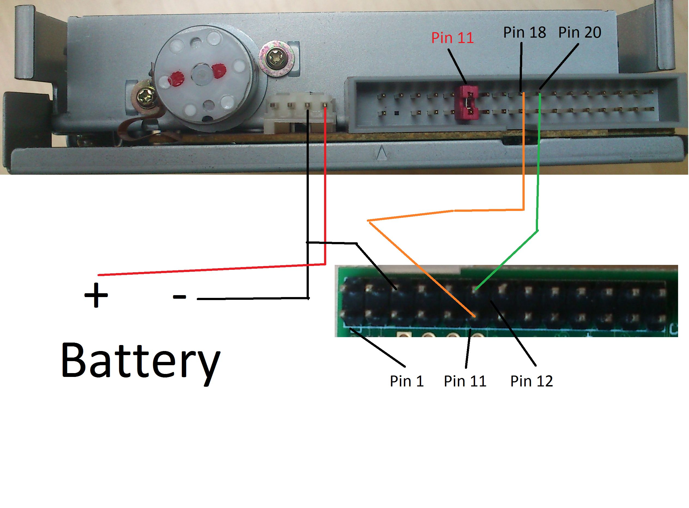

# Raspberry Pi floppy music How-To

This howto is based on [XtraPerianer's guide](https://xtraperianer.wordpress.com/2014/08/06/making-floppy-music-with-a-raspberry-pi/?lang=en)

## Introduction

Many People make music with floppy drives using Arduino, but because i didn’t had one, i tried to do it with a
Raspberry Pi, but i think there was a lack of good tutorials how to wire the Pi etc, so I will
provide this to you.

## Materials

You need:

- Raspberry Pi
- Floppy disk drive
- Power source: Its perfect if you have one from an old PC, it should be 5V, I used a 4.5 V Battery, but this is quite difficult as you need to have an adapter for the drive to connect the wires, i found one in an electronic shop specialised on things like this.
- wire: to connect everything, e.g. the power source and the battery
- jumper wire: I don’t had something like this, and i tell you, it’s very annoing to connect the GPIOs together to the disk drive. Just google “jumper wire female to female” and you can just stick them together. If you are working with GPIO you will anyway often need them.
- jumper: If you dont have a Jumper but jumper wires thats fine, just use them.

## Wiring



With this picture, it should be no problem to connect the disk drive properly. Connect the Pi without having it attached to any Power Source, because while wiring the Pi may crash if you accidentaly hit some wrong pins. If the Jumper from Pin 11 to 12 is set and you have the power source connected, the LED of the disk drive should be on.
1. Connect Pin 11 and 12 with a Jumper on the drive.
2. Connect Pin 18 of the drive with Pin 11 of the Pi(Also called GPIO 0).
3. Connect Pin 20 of the drive with Pin 12 of the Pi(Also called GPIO 1).
4. Connect the rightest Pin of the Power from the drive to the minus of your battery and also to the ground of the Pi, which is pin 6.
5. Connect the Pin left of the rightest Pin with the plus of the Battery.

## Programming

To have easy access to the GPIO Pins of the Raspberry Pi, you have to install [wiringPi]( https://projects.drogon.net/raspberry-pi/wiringpi/download-and-install/).

From the command line, you have now a Programm called gpio.
To initalise, do these commands:

```
gpio mode 0 out
gpio mode 1 out
```

The two pins we want to use for the music are now outputs.

If you type

```
gpio write 1 0
gpio write 1 1
```

You should hear a light ‘click’, and if you opened the drive you can see the head moving forward. That should identify you have wired everything correctly.

## Software

You can now try to run a programm to make real music. In the command line write:

```
mkdir floppymusic
cd floppymusic
vim main.cpp
```

(You can also use another editor if you want, i
prefer vim.)

Now you can use the code from the original guide or the one provided in this repository. Just paste it to the `main.cpp` file.

Before you can run it, you have to compile it using:

```
sudo apt-get install g++
g++ main.cpp -lwiringPi -o song
```

You should now be able to run the Programm by simply typing:

```
./song
```

It should play some Starwars Song.

## Improvements

If you know how to write code in C, you can make a better Programm or maybe one that ready
Midi files, or you can try to use other softwares, this one was the first working for me,
but there are more complex works where you can work with 2 floppy disk drives or more...
